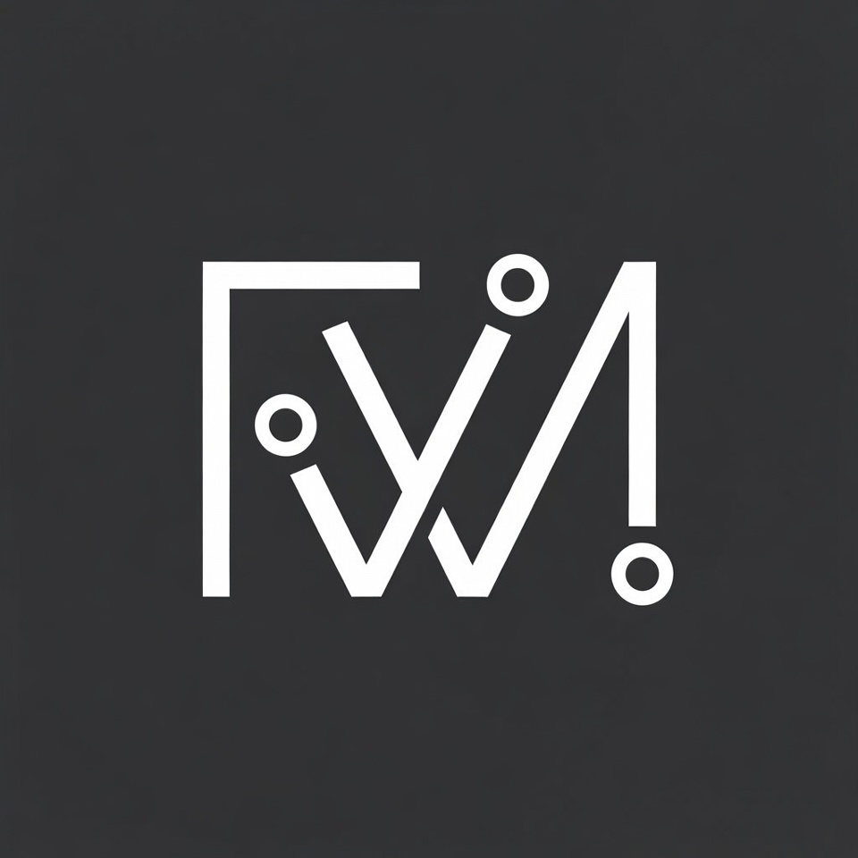

# AndrathWM (awm)



AndrathWM is a dynamic window manager for X, forked from
[dwm 6.5](https://dwm.suckless.org) by suckless.org. It adds modern desktop
integration features while maintaining dwm's minimalist philosophy and BSD
compatibility. The binary is named `awm`.

## Features

This build includes the following enhancements over vanilla dwm:

### Core Features
- **Single-tag mode**: Simplified tag management (one tag visible at a time)
- **Awesomebar**: Visual window list with icons in the status bar
- **Multi-monitor support**: Xinerama and XRandR support for multiple displays
- **Scratchpads**: Drop-down terminals and floating windows on demand
- **Application launcher**: Rofi-style launcher with icon support (Super+P)
  - Searches installed `.desktop` files and PATH executables
  - GTK icon theme integration with SVG and raster icon support
  - Reverse-DNS icon name resolution (e.g. `Alacritty` → `com.alacritty.Alacritty`)
  - Mouse-wheel and keyboard navigation
  - See [docs/LAUNCHER.md](docs/LAUNCHER.md) for details

### Modern Desktop Integration
- **StatusNotifier/AppIndicator**: Full D-Bus based system tray support
  - GTK+3, Cairo, and librsvg for icon rendering
  - SNI (StatusNotifierItem) protocol support
  - Application menu support via D-Bus
  - Icon caching with LRU eviction

- **Embedded status bar**: Built-in status module replaces external `slstatus`
  - Coroutine-driven via [minicoro](https://github.com/edubart/minicoro) (vendored, MIT-0)
  - Components: CPU%, load average, RAM used/total, battery, date/time, uptime
  - Per-component update intervals; driven by `timerfd` in the main event loop
  - Configured in `status_config.h` — no recompile of the WM core needed for format changes

- **EWMH Support**: Extended Window Manager Hints for better application compatibility
  - `_NET_CLIENT_LIST` and `_NET_CLIENT_LIST_STACKING`
  - `_NET_WM_DESKTOP` for workspace tracking
  - `_NET_WM_STATE` (fullscreen, urgent, hidden, demands attention)
  - `_NET_WM_PID` for process tracking
  - `_NET_WORKAREA` reporting
  - `_NET_FRAME_EXTENTS` for client geometry
  - `_NET_CLOSE_WINDOW` and `_NET_MOVERESIZE_WINDOW` messages

- **Idle Detection**: XScreenSaver extension support
  - `xidle` utility for querying idle time
  - `getidletime()` function available in awm
  - Example scripts for auto-locking, DPMS, and notifications
  - See [docs/XIDLE.md](docs/XIDLE.md) for detailed documentation

### UI Enhancements
- **Window icons**: Display application icons in the bar
- **Centered windows**: Center floating windows on spawn
- **Move stack**: Move windows up/down in the stack
- **Custom layouts**: Tile, Monocle, and Floating layouts
- **Dynamic colors**: Runtime color scheme modification via Xresources
  - Colors reloaded from `~/.Xresources` on restart and after autostart script

### Development Features
- **Debug logging**: Optional logging subsystem for troubleshooting
- **Thread-safe icon cache**: LRU cache with configurable limits
- **Signal-safe logging**: Proper logging for signal handlers
- **Memory management**: Automatic icon cache eviction

## Requirements

In order to build awm you need the following libraries and header files:

### Essential
- Xlib header files
- Xft header files
- libXinerama (optional, for multi-monitor support)
- libXrandr (optional, for display rotation/configuration)
- libXss (optional, for idle detection)

### For StatusNotifier/System Tray
- GTK+ 3
- Cairo
- librsvg
- gdk-pixbuf
- D-Bus
- GLib

Most distributions provide these in development packages:

**Debian/Ubuntu:**
```sh
sudo apt-get install libx11-dev libxft-dev libxinerama-dev libxrandr-dev \
    libxss-dev libgtk-3-dev libcairo2-dev librsvg2-dev libdbus-1-dev
```

**Arch Linux:**
```sh
sudo pacman -S libx11 libxft libxinerama libxrandr libxss gtk3 cairo \
    librsvg dbus glib2
```

**FreeBSD:**
```sh
pkg install xorg libXft libXinerama libXrandr libXScrnSaver gtk3 cairo \
    librsvg2 dbus glib
```

## Installation

Edit `config.mk` to match your local setup (awm is installed into the `/usr`
namespace by default).

Afterwards enter the following command to build and install awm (if necessary
as root):

```sh
make clean install
```

This will install:
- `awm` - the window manager binary
- `xidle` - the idle time query utility

### Optional Features

You can disable optional features by commenting out the relevant lines in `config.mk`:

```makefile
# Disable Xinerama support
# XINERAMALIBS  = -lXinerama
# XINERAMAFLAGS = -DXINERAMA

# Disable XRandR support
# RANDRLIBS  = -lXrandr
# RANDRFLAGS = -DXRANDR

# Disable XScreenSaver idle detection
# XSSLIBS  = -lXss
# XSSFLAGS = -DXSS

# Disable StatusNotifier/system tray
# Comment out the SNIINC, SNILIBS, and SNIFLAGS lines
```

## Running awm

Add the following line to your `.xinitrc` to start awm using `startx`:

```sh
exec awm
```

### With Idle Management

To run awm with automatic screen locking and DPMS:

```sh
# Start idle manager (lock at 5min, DPMS off at 10min)
examples/xidle-manager.sh 300 600 slock &

exec awm
```

### Status Bar

awm includes a built-in status bar module — no external `slstatus` or `xsetroot` script required.

Status components and their update intervals are configured in `status_config.h`:

```c
static const struct status_arg status_args[] = {
    { load_avg,       "🖥 %s ",              NULL,   5  },
    { battery_status, " %s ",               "BAT0", 30 },
    { ram_used,       "🐏 %s",              NULL,   10 },
    { ram_total,      "/%s ",               NULL,   60 },
    { cpu_perc,       "🔲 %s%% ",           NULL,   2  },
    { datetime,       "%s", "📆 %a %b %d 🕖 %H:%M:%S ", 1 },
};
```

Edit `status_config.h` and recompile to change format strings, intervals, or the set of components. Available components: `battery_status`, `cpu_perc`, `datetime`, `load_avg`, `ram_used`, `ram_total`, `uptime`.

The global update tick is set by `status_interval_ms` (default: 1000 ms).

### Multi-Monitor Setup

awm supports both Xinerama and XRandR for multi-monitor setups. To connect awm
to a specific display:

```sh
DISPLAY=foo.bar:1 exec awm
```

This will start awm on display `:1` of the host `foo.bar`.

## Configuration

The configuration of awm is done by creating a custom `config.h` and
(re)compiling the source code.

Copy `config.def.h` to `config.h` and edit it:

```sh
cp config.def.h config.h
vim config.h
make clean install
```

### Key Bindings

The default modifier key is `Mod4` (Windows/Super key). See `config.def.h` for the complete list of key bindings.

Some notable bindings:
- `Mod4+Return` - Spawn terminal
- `Mod4+p` - Open application launcher
- `Mod4+j/k` - Focus next/previous window
- `Mod4+h/l` - Resize master area
- `Mod4+Tab` - Toggle between current and previous tag
- `Mod4+Shift+c` - Close window
- `Mod4+Shift+q` - Quit awm

### Scratchpads

This build includes scratchpad support. Define a command array where the first
element is a one-character key string, and the rest is the command to run:

```c
static const char  notepadname[] = "notepad";
static const char *notepadcmd[]  = { "s", "st", "-t", notepadname, "-g",
    "120x34", "-e", "bash", NULL };
```

Add a matching rule (match by title, `tags=0`, floating, centered):

```c
{ NULL, NULL, "notepad", 0, 1, 1, -1, 's' },
```

Then bind a key using `.v` pointing to the command array:

```c
{ MODKEY, XK_grave, togglescratch, { .v = notepadcmd } },
```

The scratchpad starts hidden. The first keypress spawns it; subsequent presses
toggle it on and off. When toggled onto a different monitor it is automatically
re-centred.

### System Tray Configuration

The system tray behavior can be configured in `config.def.h`:

```c
static const unsigned int systraypinning = 0;  /* 0: follows selected monitor */
static const unsigned int systrayonleft = 0;   /* 0: right corner, 1: left */
static const unsigned int systrayspacing = 2;  /* spacing between icons */
static const int showsystray = 1;              /* 0 means no systray */
```

### Icon Cache Settings

The icon cache can be tuned for performance:

```c
const unsigned int iconcachesize = 128;       /* hash table size */
const unsigned int iconcachemaxentries = 256; /* max before LRU eviction */
```

## Idle Detection with xidle

This build includes `xidle`, a utility for querying X11 idle time. See [docs/XIDLE.md](docs/XIDLE.md) for complete documentation.

### Quick Start

```sh
# Query idle time in milliseconds
xidle

# Query idle time in human-readable format
xidle -h
```

### Example Scripts

Four example scripts are included in the `examples/` directory:

1. **xidle-autolock.sh** - Auto-lock screen after idle timeout
2. **xidle-dpms.sh** - Display power management
3. **xidle-notify.sh** - Desktop notifications for idle warnings
4. **xidle-manager.sh** - Combined lock + DPMS management

Example usage:

```sh
# Lock screen with slock after 5 minutes idle
examples/xidle-autolock.sh 300 slock &
```

See [docs/XIDLE.md](docs/XIDLE.md) for detailed usage and examples.

## Debug Logging

Debug logging can be enabled at compile time by uncommenting in `config.mk`:

```makefile
CPPFLAGS += -DAWM_DEBUG
CFLAGS   = -g -std=c99 -pedantic -Wall -O0 ${INCS} ${CPPFLAGS}
```

## Project Structure

```
andrathwm/
├── src/                  # Source files
│   ├── awm.c            # Main window manager code
│   ├── drw.c/drw.h      # Drawing library (Cairo/X11)
│   ├── util.c/util.h    # Utility functions
│   ├── dbus.c/dbus.h    # D-Bus integration
│   ├── sni.c/sni.h      # StatusNotifier implementation
│   ├── icon.c/icon.h    # Icon cache and rendering
│   ├── launcher.c/launcher.h  # Application launcher
│   ├── status.c/status.h      # Embedded status bar (coroutine driver)
│   ├── status_components.c/h  # Status components (CPU, RAM, battery, …)
│   ├── status_util.c/h        # Status utility functions
│   ├── menu.c/menu.h    # SNI menu support
│   ├── queue.c/queue.h  # Event queue
│   ├── log.c/log.h      # Logging subsystem
│   ├── xidle.c          # Idle detection utility
│   ├── movestack.c      # Move stack helper
│   └── transient.c      # Transient window test
├── third_party/          # Vendored libraries
│   └── minicoro.h       # Stackful coroutine library (MIT-0)
├── build/                # Build artifacts (.o files)
├── docs/                 # Documentation
│   ├── XIDLE.md         # xidle documentation
│   ├── AWESOMEBAR.md    # Awesomebar feature docs
│   ├── LAUNCHER.md      # Application launcher docs
│   ├── MULTIMONITOR.md  # Multi-monitor setup
│   ├── SYSTRAY_ICONS.md # System tray icon docs
│   └── PHASE1_IMPROVEMENTS.md  # Development notes
├── status_config.h       # Status bar component configuration
├── config.def.h          # Default configuration
├── config.h              # User configuration (not tracked)
├── config.mk             # Build configuration
├── Makefile              # Build system
├── README.md             # This file
├── LICENSE               # MIT/X Consortium License
├── awm.1                 # Man page
└── awm.png               # Icon
```

## Patches Applied

This build incorporates the following concepts/patches from the dwm ecosystem:

- Single-tag mode (custom implementation)
- Awesomebar with icons
- Application launcher with GTK icon theme support
- Embedded status bar (coroutine-driven, replaces slstatus)
- StatusNotifier/AppIndicator system tray
- EWMH support (comprehensive implementation)
- Multi-monitor support (fixmultimon patches)
- Scratchpads
- Move stack
- Centered floating windows
- XScreenSaver idle detection (custom implementation)

## Development

### Building for Development

```sh
# Enable debug logging
vim config.mk  # Uncomment debug flags

# Build with debug symbols
make clean && make

# Run in Xephyr for testing
Xephyr -br -ac -noreset -screen 1280x720 :1 &
DISPLAY=:1 ./awm
```

### Code Style

This codebase follows the suckless.org coding style:
- K&R style with tabs for indentation
- 80 character line limit where practical
- Minimal abstractions
- Direct X11 API usage

### Thread Safety

Icon rendering and D-Bus operations are thread-safe:
- Icon cache uses proper locking
- D-Bus file descriptors are properly managed
- Signal handlers use async-signal-safe logging

## License

MIT/X Consortium License - see LICENSE file for details.

## Links

- [upstream dwm](https://dwm.suckless.org)
- [suckless.org](https://suckless.org)
- [xidle documentation](docs/XIDLE.md)

## Acknowledgments

AndrathWM is a fork of dwm 6.5 by suckless.org, extended with modern desktop
integration features while maintaining the minimalist philosophy and BSD
compatibility.
