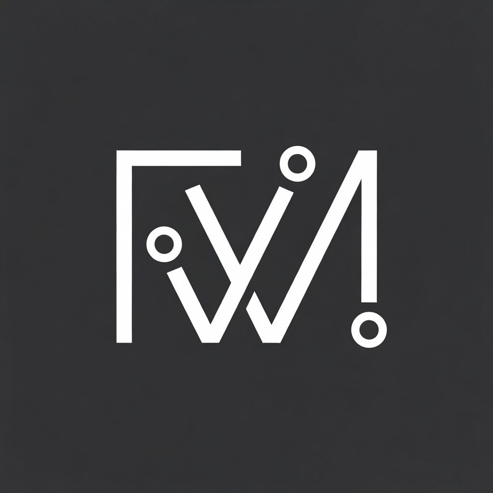

# AndrathWM (awm)



AndrathWM is a dynamic window manager for X, forked from
[dwm 6.5](https://dwm.suckless.org) by suckless.org. It adds modern desktop
integration features while maintaining dwm's minimalist philosophy and BSD
compatibility. The binary is named `awm`.

## Features

This build includes the following enhancements over vanilla dwm:

### Core Features
- **Single-tag mode**: Simplified tag management (one tag visible at a time)
- **Awesomebar**: Visual window list with icons in the status bar
- **Multi-monitor support**: Xinerama and XRandR support for multiple displays
- **Scratchpads**: Drop-down terminals and floating windows on demand
- **Application launcher**: Rofi-style launcher with icon support (Super+P)
  - Searches installed `.desktop` files and PATH executables
  - GTK icon theme integration with SVG and raster icon support
  - Reverse-DNS icon name resolution (e.g. `Alacritty` → `com.alacritty.Alacritty`)
  - Mouse-wheel and keyboard navigation
  - See [docs/LAUNCHER.md](docs/LAUNCHER.md) for details

### Modern Desktop Integration
- **StatusNotifier/AppIndicator**: Full D-Bus based system tray support
  - SNI (StatusNotifierItem) protocol support
  - Application menu support via D-Bus
  - SVG icon rasterisation via librsvg
  - Icon caching with LRU eviction

- **Embedded status bar**: Built-in status module replaces external `slstatus`
  - Timer-driven via GLib `GTimeout` source integrated with the main event loop
  - Components: CPU%, load average, RAM used/total, battery, date/time, uptime
  - Per-component update intervals
  - Configured in `status_config.h` — no recompile of the WM core needed for format changes

- **EWMH Support**: Extended Window Manager Hints for better application compatibility
  - `_NET_CLIENT_LIST` and `_NET_CLIENT_LIST_STACKING`
  - `_NET_WM_DESKTOP` for workspace tracking
  - `_NET_WM_STATE` (fullscreen, urgent, hidden, demands attention)
  - `_NET_WM_PID` for process tracking
  - `_NET_WORKAREA` reporting
  - `_NET_FRAME_EXTENTS` for client geometry
  - `_NET_CLOSE_WINDOW` and `_NET_MOVERESIZE_WINDOW` messages

- **Idle Detection**: XScreenSaver extension support via pure XCB
  - `xidle` utility for querying idle time
  - Example scripts for auto-locking, DPMS, and notifications
  - See [docs/XIDLE.md](docs/XIDLE.md) for detailed documentation

### UI Enhancements
- **Window icons**: Display application icons in the bar
- **Centered windows**: Center floating windows on spawn
- **Move stack**: Move windows up/down in the stack
- **Custom layouts**: Tile, Monocle, and Floating layouts
- **Dynamic colors**: Runtime color scheme modification via Xresources
- **Window switcher**: Alt+Tab / Super+Tab overlay with live thumbnails
  - Horizontal card strip with per-window live thumbnails
  - EGL path: GL FBO readback (always current frame)
  - XRender path: server-side picture composite + `xcb_get_image`
  - Keyboard grab via XCB while overlay is open; confirmed on modifier release
  - See [docs/SWITCHER.md](docs/SWITCHER.md) for details

### Compositor
- **Built-in compositor**: XRender and EGL/GL backends
  - XRender fallback works in all environments (including Xephyr)
  - EGL/GL path used when DRI3 and `EGL_KHR_image_pixmap` are available
  - X Present vblank loop for tear-free rendering
  - Fullscreen bypass (unredirect) with 40 ms deferred activation
- **`awm-ui` helper process**: GTK popup menus (launcher, SNI context menus)
  run out-of-process over a `SOCK_SEQPACKET` socketpair

### Development Features
- **Debug logging**: Optional logging subsystem (`awm_debug`/`awm_info`/`awm_warn`/`awm_error`)
- **Thread-safe icon cache**: LRU cache with configurable limits
- **Signal-safe logging**: Proper logging for signal handlers
- **`-s` flag**: Skip autostart script at startup (useful for testing)

## Requirements

awm is **Xlib-free**. It uses XCB directly for all X11 protocol communication.
No `libX11`, `libXinerama`, `libXrandr`, or `libXss` are needed.

### Build dependencies

| Library | Purpose |
|---------|---------|
| `xcb`, `xcb-icccm`, `xcb-randr`, `xcb-keysyms` | Core XCB + WM hints |
| `xcb-xinerama`, `xcb-cursor`, `xcb-renderutil` | Multi-monitor, cursors, XRender utils |
| `xcb-composite`, `xcb-damage`, `xcb-xfixes`, `xcb-shape`, `xcb-render`, `xcb-present` | Compositor extensions |
| `xcb-screensaver` | Idle detection (`xidle`) |
| `xkbcommon` | Keysym names |
| `EGL`, `GL` | Compositor EGL/GL backend |
| `pangocairo`, `cairo` | Text rendering and drawing |
| `gtk-3`, `gdk-3`, `gdk-pixbuf-2` | Launcher and SNI menu UI |
| `librsvg-2` | SVG icon rasterisation |
| `dbus-1`, `glib-2` | D-Bus / SNI / event loop |

**Debian/Ubuntu:**
```sh
sudo apt-get install \
    libxcb1-dev libxcb-icccm4-dev libxcb-randr0-dev libxcb-keysyms1-dev \
    libxcb-xinerama0-dev libxcb-cursor-dev libxcb-render-util0-dev \
    libxcb-composite0-dev libxcb-damage0-dev libxcb-xfixes0-dev \
    libxcb-shape0-dev libxcb-render0-dev libxcb-present-dev \
    libxcb-screensaver0-dev libxkbcommon-dev \
    libegl-dev libgl-dev \
    libpango1.0-dev libcairo2-dev \
    libgtk-3-dev librsvg2-dev libdbus-1-dev libglib2.0-dev
```

**Arch Linux:**
```sh
sudo pacman -S \
    libxcb xcb-util-wm xcb-util-keysyms xcb-util-cursor xcb-util-renderutil \
    xkbcommon mesa \
    pango cairo \
    gtk3 librsvg dbus glib2
```

**FreeBSD:**
```sh
pkg install \
    libxcb xcb-util-wm xcb-util-keysyms xcb-util-cursor xcb-util-renderutil \
    libxkbcommon mesa-libs \
    pango cairo \
    gtk3 librsvg2 dbus glib
```

## Installation

Edit `config.mk` to match your local setup (awm is installed into the `/usr`
namespace by default).

Afterwards enter the following command to build and install awm (if necessary
as root):

```sh
make clean install
```

This will install:
- `awm` — the window manager binary
- `awm-ui` — the out-of-process GTK UI helper
- `xidle` — the idle time query utility

### Build variants

```sh
make              # default: drw_cairo.c backend (pure Cairo, no XCB in hot path)
make DRW_LEGACY=1 # use original drw.c (XCB + Cairo) — deprecated, will be removed in feature/backend-abstraction
```

### Optional Features

Comment out lines in `config.mk` to disable optional subsystems:

```makefile
# Disable Xinerama support
# XINERAMAFLAGS = -DXINERAMA

# Disable XRandR support
# RANDRFLAGS = -DXRANDR

# Disable XScreenSaver idle detection
# XSSFLAGS = -DXSS

# Disable StatusNotifier/system tray
# Comment out the SNIINC, SNILIBS, and SNIFLAGS lines

# Disable compositor
# Comment out COMPOSITORLIBS and COMPOSITORFLAGS
```

## Running awm

Add the following line to your `.xinitrc` to start awm using `startx`:

```sh
exec awm
```

### With Idle Management

To run awm with automatic screen locking and DPMS:

```sh
# Start idle manager (lock at 5min, DPMS off at 10min)
examples/xidle-manager.sh 300 600 slock &

exec awm
```

### Status Bar

awm includes a built-in status bar module — no external `slstatus` or `xsetroot` script required.

Status components and their update intervals are configured in `status_config.h`:

```c
static const struct status_arg status_args[] = {
    { load_avg,       "🖥 %s ",              NULL,   5  },
    { battery_status, " %s ",               "BAT0", 30 },
    { ram_used,       "🐏 %s",              NULL,   10 },
    { ram_total,      "/%s ",               NULL,   60 },
    { cpu_perc,       "🔲 %s%% ",           NULL,   2  },
    { datetime,       "%s", "📆 %a %b %d 🕖 %H:%M:%S ", 1 },
};
```

Edit `status_config.h` and recompile to change format strings, intervals, or the set of components. Available components: `battery_status`, `cpu_perc`, `datetime`, `load_avg`, `ram_used`, `ram_total`, `uptime`.

The global update tick is set by `status_interval_ms` (default: 1000 ms).

### Multi-Monitor Setup

awm supports both Xinerama and XRandR for multi-monitor setups. See
[docs/MULTIMONITOR.md](docs/MULTIMONITOR.md) for details.

To connect awm to a specific display:

```sh
DISPLAY=foo.bar:1 exec awm
```

## Configuration

The configuration of awm is done by creating a custom `config.h` and
(re)compiling the source code.

Copy `config.def.h` to `config.h` and edit it:

```sh
cp config.def.h config.h
vim config.h
make clean install
```

### Key Bindings

The default modifier key is `Mod4` (Super/Windows key). Key names use
`XKB_KEY_*` constants from `<xkbcommon/xkbcommon-keysyms.h>` and modifier
masks use `XCB_MOD_MASK_*`. See `config.def.h` for the complete list.

Some notable bindings:
- `Mod4+Return` — Spawn terminal
- `Mod4+p` — Open application launcher
- `Mod4+j/k` — Focus next/previous window
- `Mod4+Ctrl+h/l` — Resize master area
- `Mod4+Tab` — Toggle between current and previous tag
- `Mod4+Shift+c` — Close window
- `Mod4+Shift+q` — Quit awm
- `Mod4+Shift+r` — Restart awm (re-execs; `-s` flag is preserved if set)

### Scratchpads

This build includes scratchpad support. Define a command array where the first
element is a one-character key string, and the rest is the command to run:

```c
static const char  notepadname[] = "notepad";
static const char *notepadcmd[]  = { "s", "st", "-t", notepadname, "-g",
    "120x34", "-e", "bash", NULL };
```

Add a matching rule (match by title, `tags=0`, floating, centered):

```c
{ NULL, NULL, "notepad", 0, 1, 1, -1, 's' },
```

Then bind a key using `.v` pointing to the command array:

```c
{ MODKEY, XKB_KEY_grave, togglescratch, { .v = notepadcmd } },
```

The scratchpad starts hidden. The first keypress spawns it; subsequent presses
toggle it on and off. When toggled onto a different monitor it is automatically
re-centred.

### System Tray Configuration

The system tray behavior can be configured in `config.def.h`:

```c
static const unsigned int systraypinning = 0;  /* 0: follows selected monitor */
static const unsigned int systrayonleft = 0;   /* 0: right corner, 1: left */
static const unsigned int systrayspacing = 2;  /* spacing between icons */
static const int showsystray = 1;              /* 0 means no systray */
```

### Icon Cache Settings

The icon cache can be tuned for performance:

```c
const unsigned int iconcachesize = 128;       /* hash table size */
const unsigned int iconcachemaxentries = 256; /* max before LRU eviction */
```

## Idle Detection with xidle

This build includes `xidle`, a utility for querying X11 idle time. See [docs/XIDLE.md](docs/XIDLE.md) for complete documentation.

### Quick Start

```sh
# Query idle time in milliseconds
xidle

# Query idle time in human-readable format
xidle -h
```

### Example Scripts

Four example scripts are included in the `examples/` directory:

1. **xidle-autolock.sh** — Auto-lock screen after idle timeout
2. **xidle-dpms.sh** — Display power management
3. **xidle-notify.sh** — Desktop notifications for idle warnings
4. **xidle-manager.sh** — Combined lock + DPMS management

Example usage:

```sh
# Lock screen with slock after 5 minutes idle
examples/xidle-autolock.sh 300 slock &
```

See [docs/XIDLE.md](docs/XIDLE.md) for detailed usage and examples.

## Debug Logging

Debug logging is enabled by default in `config.mk` (`-DAWM_DEBUG`). To disable:

```makefile
# comment out or remove:
CPPFLAGS += -DAWM_DEBUG
```

Log macros: `awm_debug()`, `awm_info()`, `awm_warn()`, `awm_error()` — all
write to stderr with a level prefix.

## Project Structure

```
andrathwm/
├── src/
│   ├── awm.c/awm.h              # Core WM: setup, event loop, main()
│   ├── awm_ui.c                 # Out-of-process GTK UI helper (awm-ui binary)
│   ├── ui_proto.h               # IPC protocol between awm and awm-ui
│   ├── client.c/client.h        # Client (window) management
│   ├── events.c/events.h        # XCB event dispatch, xcb_error_handler
│   ├── monitor.c/monitor.h      # Monitor management, bar, tile/monocle
│   ├── ewmh.c/ewmh.h            # EWMH (_NET_WM_*) support
│   ├── compositor.c/compositor.h         # Compositor shared state + public API
│   ├── compositor_backend.h              # Backend vtable + shared inline helpers
│   ├── compositor_egl.c                  # EGL/GL compositor backend
│   ├── compositor_xrender.c              # XRender compositor backend
│   ├── switcher.c/switcher.h             # Alt+Tab window switcher with live thumbnails
│   ├── drw.c/drw.h              # Drawing library (XCB + PangoCairo) — to be replaced by render.h/render_cairo_xcb.c
│   ├── drw_cairo.c              # Pure-Cairo drawing backend (default) — to be renamed render_cairo_xcb.c
│   ├── x11_constants.h          # KeySym typedef, LASTEvent, X_ opcodes
│   ├── dbus.c/dbus.h            # D-Bus integration
│   ├── sni.c/sni.h              # StatusNotifier (SNI) system tray
│   ├── icon.c/icon.h            # Icon cache and rendering
│   ├── launcher.c/launcher.h    # Application launcher (GTK)
│   ├── menu.c/menu.h            # SNI context menu (GTK)
│   ├── systray.c/systray.h      # XEMBED system tray
│   ├── status.c/status.h        # Embedded status bar (GLib timer-driven)
│   ├── status_components.c/h    # Status components (CPU, RAM, battery, …)
│   ├── status_util.c/h          # Status utility functions
│   ├── spawn.c/spawn.h          # Process spawning
│   ├── xrdb.c/xrdb.h            # Xresources query (pure XCB)
│   ├── xsource.c/xsource.h      # GLib GSource wrapping XCB fd — to be renamed platform_x11_source.c/platform_source.h
│   ├── log.c/log.h              # Logging subsystem
│   ├── util.c/util.h            # Utility functions
│   └── xidle.c                  # Idle detection utility (xcb-screensaver)
├── third_party/                 # Vendored libraries
├── build/                       # Build artifacts (.o files)
├── docs/                        # Documentation
│   ├── AWESOMEBAR.md            # Awesomebar feature docs
│   ├── BACKEND_ABSTRACTION.md   # Backend abstraction refactor plan (future)
│   ├── LAUNCHER.md              # Application launcher docs
│   ├── MULTIMONITOR.md          # Multi-monitor setup
│   ├── SWITCHER.md              # Window switcher docs
│   ├── SYSTRAY_ICONS.md         # System tray icon theme configuration
│   └── XIDLE.md                 # xidle documentation
├── examples/                    # xidle example scripts
├── status_config.h              # Status bar component configuration
├── config.def.h                 # Default configuration
├── config.h                     # User configuration (not tracked by git)
├── config.mk                    # Build configuration
├── Makefile                     # Build system
├── xcb-migration.md             # XCB migration history and API cheat-sheet
├── README.md                    # This file
├── LICENSE                      # MIT/X Consortium License
├── awm.1                        # Man page
└── awm.png                      # Icon
```

## Roadmap

### Backend abstraction (`feature/backend-abstraction`)

The codebase currently couples WM logic, bar rendering, and input handling
directly to XCB/X11. The planned backend abstraction refactor will decouple
these layers to make a future wlroots/Wayland backend possible without
invasive surgery to core WM logic.

Key changes planned on the `feature/backend-abstraction` branch:

- **`PlatformCtx` struct** — consolidate all X11 connection state (`xc`,
  `root`, atoms, `keysyms`, DPI constants) from ~30 bare `extern` globals
  into a single struct.
- **`WmBackend` runtime vtable** — one function pointer per logical WM
  operation (geometry, focus, stacking, grabs, property writes). Core WM
  files (`client.c`, `monitor.c`, `events.c`) call through the vtable and
  contain no `xcb_*` calls after the migration.
- **`RenderBackend` vtable** — thin wrapper over the existing `Drw` API;
  `drw_cairo.c` becomes `render_cairo_xcb.c`; the legacy `drw.c`
  (XCB+XRender hybrid) is retired.
- **`platform_source`** — `xsource.c` renamed to `platform_x11_source.c`
  with a backend-neutral `platform_source_attach()` declaration.
- **Switcher simplification** — the inline XRender thumbnail path in
  `switcher.c` is removed; all thumbnail captures route through
  `comp_capture_thumb()`.
- **systray / ewmh guards** — both files wrapped in `#ifdef BACKEND_X11`
  since they have no Wayland equivalents.

The compositor (EGL/XRender) is **out of scope** for this refactor and
remains X11-only. Per-monitor fractional DPI is deferred until XLibre
exposes fractional scaling at the protocol level. The target Wayland
backend is **wlroots** (not raw `libwayland-server`), but no Wayland code
is written on this branch — it is purely a structural preparation.

See [docs/BACKEND_ABSTRACTION.md](docs/BACKEND_ABSTRACTION.md) for the
full design, vtable definitions, migration steps, and merge checklist.

## Patches Applied

This build incorporates the following concepts/patches from the dwm ecosystem:

- Single-tag mode (custom implementation)
- Awesomebar with icons
- Application launcher with GTK icon theme support
- Embedded status bar (GLib timer-driven, replaces slstatus)
- StatusNotifier/AppIndicator system tray
- EWMH support (comprehensive implementation)
- Multi-monitor support (RandR + Xinerama)
- Scratchpads
- Move stack
- Centered floating windows
- XScreenSaver idle detection (pure XCB via xcb-screensaver)
- Built-in compositor (XRender + EGL/GL, X Present vblank)
- Window switcher (Alt+Tab / Super+Tab, live thumbnails via GL FBO / XRender+get_image)

## Development

### Building for Development

```sh
# Build with debug symbols and logging (default)
make clean && make

# Run in Xephyr for testing (compositor uses XRender fallback in Xephyr)
Xephyr :1 -screen 1280x720 &
sleep 1
DISPLAY=:1 ./awm

# Skip autostart during testing
DISPLAY=:1 ./awm -s
```

### Code Style

This codebase follows the suckless.org coding style:
- K&R style with tabs for indentation
- 80 character line limit where practical
- Minimal abstractions
- XCB for all X11 protocol communication (no Xlib)
- `config.h` must be the last `#include` in any `.c` file that uses it
- Only `src/awm.c` defines `AWM_CONFIG_IMPL` before including `config.h`

### Thread Safety

Icon rendering and D-Bus operations are thread-safe:
- Icon cache uses proper locking
- D-Bus file descriptors are properly managed
- Signal handlers use async-signal-safe logging

## License

MIT/X Consortium License — see LICENSE file for details.

## Links

- [upstream dwm](https://dwm.suckless.org)
- [suckless.org](https://suckless.org)
- [XCB migration history](xcb-migration.md)
- [xidle documentation](docs/XIDLE.md)

## Acknowledgments

AndrathWM is a fork of dwm 6.5 by suckless.org, extended with modern desktop
integration features while maintaining the minimalist philosophy and BSD
compatibility.
